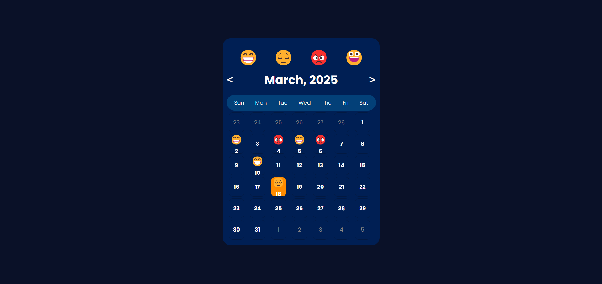

# Mood Tracker Calendar

## Overview
This is a simple Mood Tracker Calendar where users can drag and drop emojis to different dates to log their mood for that day. The calendar updates dynamically, allowing users to navigate through months and store their moods using local storage.

## Features
- **Drag and Drop Moods**: Users can drag an emoji to a date to log their mood.
- **Calendar Navigation**: Move between months using previous and next buttons.
- **Local Storage Support**: Saves moods persistently, so they remain even after refreshing the page.
- **Current Date Highlighting**: The current date is highlighted for easy tracking.
- **Responsive Design**: Works on mobile and desktop devices.

## Screenshots
### Mood Tracker Interface



## Technologies Used
- HTML
- CSS
- JavaScript (ES6)
- LocalStorage (for data persistence)

## Installation and Usage
1. **Clone the repository:**
   ```sh
   git clone https://github.com/your-repo/mood-tracker-calendar.git
   ```
2. **Navigate to the project folder:**
   ```sh
   cd mood-tracker-calendar
   ```
3. **Open `index.html` in a browser.**

## Deployment
You can access the live version of the Mood Tracker Calendar here:
[Live Demo](https://moodtracker-4ypp.vercel.app/)

## How to Use
1. Drag an emoji from the emoji bar.
2. Drop it onto a date in the calendar.
3. The emoji will be saved for that date.
4. Navigate between months using the `<` and `>` buttons.
5. Refreshing the page retains the saved moods using local storage.

## File Structure
```
📂 mood-tracker-calendar
├── 📄 index.html  # Main HTML file
├── 📄 style.css   # Stylesheet for UI
├── 📄 script.js   # JavaScript logic for calendar & mood tracking
├── 📂 screenshots # Folder containing UI screenshots
├── 📄 README.md   # Project documentation
```

## Future Improvements
- Add a feature to remove or change moods for a specific date.
- Implement a backend to store data permanently.
- Enhance UI with animations and additional mood tracking features.

